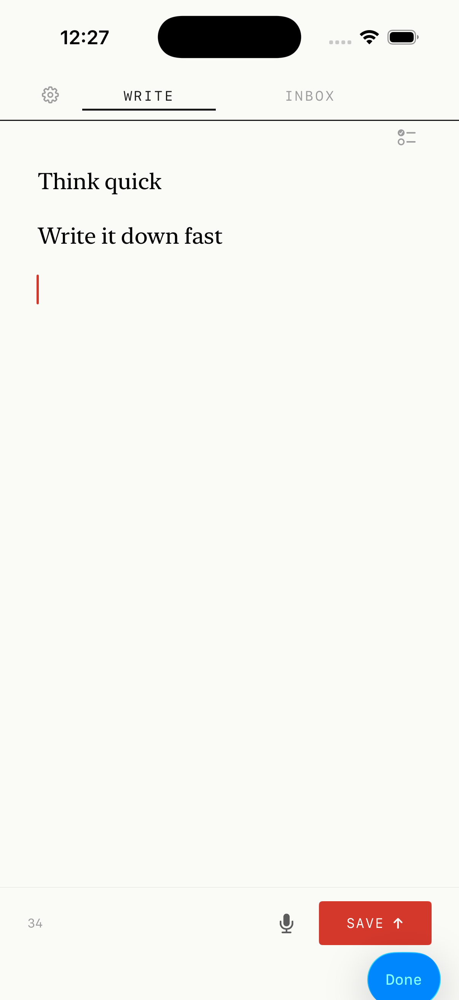
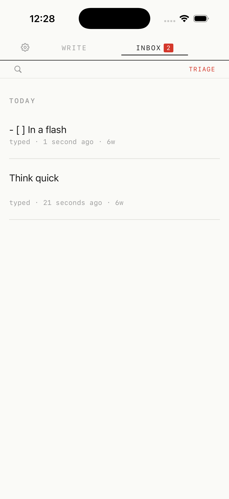

# Flash Note

iOS 26 + watchOS 26 quick-capture note app with an editorial aesthetic.

Built for the moment when you need to get something out of your head immediately. Shake, capture, sort later.

  
  
  

## Features

### Capture
- Shake-to-capture — opens instantly from anywhere
- Voice capture with transcription
- Share Extension — capture from any app
- Watch companion — capture from your wrist

### Triage Workflow
- Inbox → categorize → archive flow
- Tag and filter notes
- Spotlight indexing — find notes system-wide

### Platform
- Home Screen and Lock Screen widgets
- App Intents for Siri and Shortcuts
- Editorial/newspaper visual aesthetic

## Architecture

7 build targets sharing a Swift package core:

- `FlashNoteCore` — models, services, data layer
- `FlashNoteApp` — iOS main app
- `FlashNoteWatch` — watchOS companion
- `FlashNoteWidgets` — WidgetKit extension
- `FlashNoteShareExtension` — Share Sheet integration
- `FlashNoteIntents` — App Intents / Spotlight
- `FlashNoteAppTests` — test target

## Tech

- Swift 6 strict concurrency
- SwiftUI + SwiftData
- App Intents for Spotlight and Siri integration
- WidgetKit for home screen and lock screen
- Shake detection via UIKit motion events

## Tests

30 test files covering view models, navigation, data persistence, and core services.

## Requirements

- iOS 26.0+ / watchOS 26.0+
- Xcode 26+
